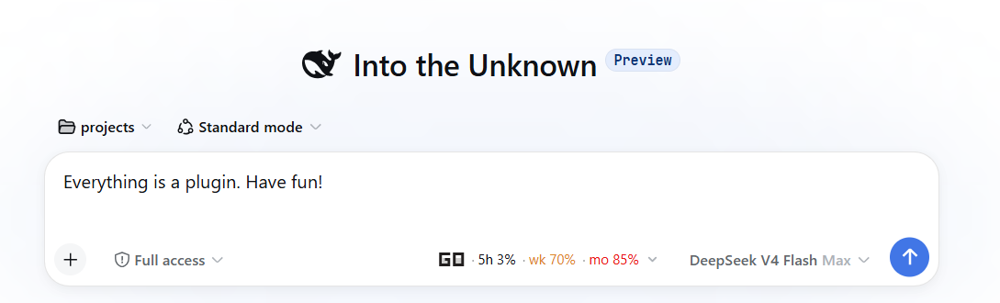
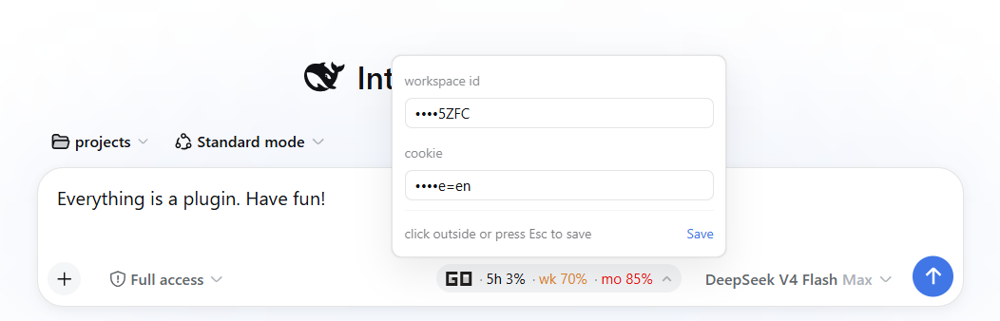
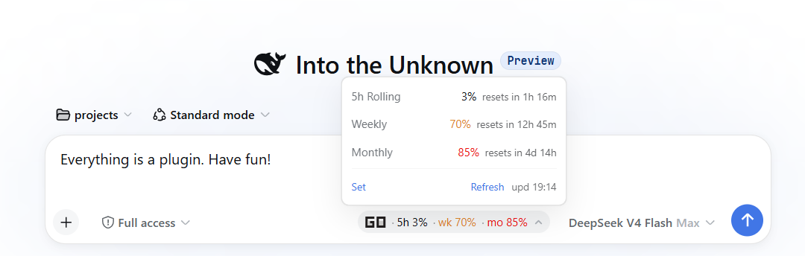

# dsh-opencode-go-usage

English | [中文](README.md)

[](https://www.npmjs.com/package/dsh-ocgo-usage)
[](./LICENSE)
[](https://awesome-dsh-plugin.com)



A [DeepSeek Harness](https://github.com/deepseek-ai/deepseek-harness) (dsh) **bundle** that shows [OpenCode Go](https://opencode.ai/docs/go/) subscription usage in the Web GUI's composer dock — the same seat as the built-in conversation stats line.

The Web counterpart of the [pi-ocgo-usage](https://github.com/v587d/pi-ocgo-usage) Pi extension: three usage windows (rolling 5h, weekly, monthly) with percentages and reset countdowns, color-coded so you see a window approaching exhaustion before you hit the rate limit mid-work.

```
OpenCode Go: 5h 0% (1h 23m) · wk 65% (2d 20h) · mo 83% (6d 21h) · upd 20:15
```

## Features

- **Three windows** — rolling (5h) / weekly / monthly percent + reset countdown
- **Color thresholds** — muted → warning (≥80%) → error (≥90% or rate-limited)
- **Data freshness** — `upd HH:MM` shows the last successful fetch time
- **Lightweight polling** — every 10 s (and on tab refocus); the host caches for 300 s (TTL configurable) with a 60 s failure cooldown, so opencode.ai is never hammered
- **Provider-aware** — the chip shows only while the session's current model routes through the `opencode-go` provider. Visibility reads the session's durable `modelSelection` projection (client `sessions` service, ~ms warm; falls back to the `session.projections` Remote), so switching to e.g. DeepSeek official hides it within one 10 s cycle and switching back re-shows it (mirrors pi-ocgo-usage)
- **Click to expand** — detail panel with per-window reset countdowns plus budget / requests / tokens / cost / balance, a `Set` credential editor, and `refresh upd HH:MM`
- **Built-in credential editor** — no terminal needed: the `Set` panel edits workspace id / API key / console token in place (fields show `••••` + last 4 chars; click outside / Esc / Save confirms the write)
- **Graceful degradation** — missing config shows `<err:noconfig>`, HTTP failures `<err:httpXXX>`; on error, clicking the chip opens the Set editor directly
- **Credentials stay on the host** — the browser only ever talks to the same-origin `/api/ocgo-usage` JSON endpoint; the API key and token never reach the page

> **⚠️ The API key and console token grant access to your OpenCode account.** Treat them like passwords — see [Configuration](#configuration).

## Requirements

- DeepSeek Harness `0.1.2-rc.1` or newer (web profile)
- pnpm on `PATH` (for `dsh plugin`)

## Installation

This package is a standard dsh **bundle**: it declares `dsh.bundle` in its manifest and installs through `dsh plugin --profile web add <spec>` (a pnpm forwarder), which links the package and appends it to the profile's `dsh.profile.bundles`. The repo ships pre-built `lib/` artifacts, so **no build step or install-time build permission is needed** — this follows the official [publish guide](https://github.com/deepseek-ai/deepseek-harness/blob/master/docs/user/develop/basic/publish.md).

### From GitHub (recommended for users)

```sh
dsh plugin --profile web add github:v587d/dsh-opencode-go-usage
```

Because `lib/` is committed, pnpm installs the built package directly and never asks for a build-script allowance.

### From npm (after a release)

```sh
dsh plugin --profile web add dsh-ocgo-usage
```

> **About the name:** the repo is `dsh-opencode-go-usage`, but that npm name is already taken by a similar third-party plugin, so the npm package publishes as `dsh-ocgo-usage`. GitHub installs (recommended) are unaffected: `dsh plugin --profile web add github:v587d/dsh-opencode-go-usage`.

### From a tarball

```sh
pnpm pack            # in this repo → dsh-ocgo-usage-0.1.0.tgz
dsh plugin --profile web add ./dsh-ocgo-usage-0.1.0.tgz
```

### From a local checkout (development)

```sh
git clone https://github.com/v587d/dsh-opencode-go-usage.git
cd dsh-opencode-go-usage
pnpm install
pnpm run build
dsh plugin --profile web add link:$(pwd)
```

**Restart `dsh web`, then refresh the page.** The usage chip appears in the composer dock next to the conversation stats line. Verify the plugin layer is composed without booting:

```sh
dsh --profile web --dump-config   # shows a "# == dsh-ocgo-usage" layer
```

## Configuration

The plugin reads up to **three fields** from opencode.ai. Where to put them: the Set panel (Option 1), env vars (Option 2), or the config file (Option 3).

| Field | Required | Purpose | How to obtain |
| --- | --- | --- | --- |
| **workspace ID** | recommended | identifies the workspace (`x-org-id` for the console endpoints) | see [Get the workspace ID](#get-the-workspace-id) |
| **API key** | **yes** | the **5h / weekly / monthly windows** + cumulative usage (`zen/go/v1/usage`, `usage/summary`) | see [Get the API key](#get-the-api-key) |
| **Console token** | optional | monthly budget + balance (`budgets/org`, `billing/status`) | see [Get the console token](#get-the-console-token) |

> With just the API key the chip still works: three windows + cumulative usage. Without the console token you only miss the budget/balance rows.

### Get the workspace ID

Log in to [opencode.ai](https://opencode.ai) in a browser, open any console page (e.g. **Service accounts**), and read the address bar:

```
https://opencode.ai/console/wrk_01KW0ZYWDSDEPS16NSM5TT0Z32/service-accounts
                        └──── the wrk_-prefixed segment is the workspace ID ────┘
```

### Get the API key

1. Log in to [opencode.ai](https://opencode.ai) → console → **Service accounts** page → create a service account (or reuse one).
2. Under that account click **Create API key** and copy it immediately (it looks like `oc_sk_...` and is **shown only once**).
3. Paste it into the plugin's **API key** field (or `OPENCODE_GO_API_KEY` / config `apiKey`).

> Local shortcut: if you already logged in with the opencode CLI, the `key` under `opencode-go` in `~/.local/share/opencode/auth.json` is a working API key.

### Get the console token

1. Log in to opencode.ai in a browser → press F12 → **Application** → **Storage → Cookies** → select `https://opencode.ai`.
2. Find the **`__Host-console_session`** row and copy its **Value** (it looks like `st_...`).
3. Paste it into the plugin's **Console token** field (or `OPENCODE_GO_CONSOLE_TOKEN` / config `token`).

> `__Host-` cookies are HttpOnly: `document.cookie` never shows it — you must copy it from the Application panel (or the `Cookie:` header of a `/console/api` request in Network).

### Option 1: the in-UI Set panel (easiest)

Click the chip to expand → `Set` (bottom-left) → type the three fields (**workspace id**, **API key**, **console token**; existing values show as `••••` + last 4 chars; focus a field to type a replacement) → click outside / press Esc / hit Save — it takes effect immediately.



### Option 2: environment variables (`OPENCODE_GO_*`)

```sh
export OPENCODE_GO_WORKSPACE_ID="wrk_01XXXXXXXXXXXXXXXXXXXXXXXX"
export OPENCODE_GO_API_KEY="oc_sk_..."          # required: windows + cumulative usage
export OPENCODE_GO_CONSOLE_TOKEN="st_..."       # optional: budget + balance
# legacy (no longer recommended):
# export OPENCODE_GO_COOKIE="auth=Fe26.2*...; oc_locale=en"
```

### Option 3: config file

Write `$DSH_HOME/ocgo-usage.json` (desktop: `$DSH_HOME` = `~/Library/Application Support/dsh-desktop/harness`):

```jsonc
{
  "workspaceID": "wrk_01XXXXXXXXXXXXXXXXXXXXXXXX",
  "apiKey": "oc_sk_...",
  "token": "st_..."        // optional
}
```

```sh
chmod 600 $DSH_HOME/ocgo-usage.json
```

Priority: env vars > config file > built-in defaults.

### Optional overrides

| Env var | Default | Description |
|---|---|---|
| `OPENCODE_GO_BASE_URL` | `https://opencode.ai` | API base URL |
| `OPENCODE_GO_CACHE_TTL` | `300` | Host cache TTL in seconds, clamped to 60–3600 |
| `OPENCODE_GO_TIMEOUT_MS` | `10000` | HTTP timeout |

Composition-level config (via `~/.dsh/profiles/web/cordis.patch.yml`):

```yaml
- id: ocgo-usage
  config:
    enabled: false    # master switch, default true
```

> **Credential expiration:** an invalid API key / console token makes the chip show `<err:http401>`. Re-obtain and replace it via the Set panel (or the env/config routes above).

## Usage

Click the chip to expand the detail panel: each window shows its full name, percent, and reset countdown; `refresh upd HH:MM` (bottom-right) refreshes manually and shows the data time.



## How it works

- **Host half** (`src/index.ts`, `src/service.ts`, `src/api.ts`, `src/routes.ts`) — carries the credentials to the official endpoints: `GET https://opencode.ai/zen/go/v1/usage` (Bearer **API key**) for the three plan windows; `GET https://opencode.ai/console/api/usage/summary` (Bearer key or token + `x-org-id`) for cumulative totals; `GET .../console/api/budgets/org` and `.../billing/status` (Bearer **token**) for the monthly budget and balance. Results are cached and served as same-origin JSON at `/api/ocgo-usage` (+ `/api/ocgo-usage/refresh`, `/api/ocgo-usage/config`).
- **Browser half** (`src/client/`) — registers a chip into the `conversation.input.right` slot (composer tool row, next to the model selector), polls the host endpoints every 10 s, and renders the three windows (severity colors) plus budget/requests/tokens/cost/balance; visibility comes from the client `sessions` service's durable `modelSelection` projection.

The browser never sees the credentials; all fetching and parsing happen on the host.

## Security

- The **API key** and **console token** are your OpenCode account credentials (the console token is effectively a login session). Anyone holding them can read your workspace usage, subscription, and billing details — treat them like passwords.
- The plugin **never** logs credentials, includes them in error messages, or sends them to the browser.
- The config editor only writes new values to `$DSH_HOME/ocgo-usage.json` (chmod 600); the browser only ever sees the `••••` + last-4 masked view.

## Development

```sh
pnpm install
pnpm run build     # tsc -b && tsdown → lib/
pnpm run typecheck # tsc -b --pretty false
pnpm test          # vitest run (parser / config / service)
```

The build config (`shared/tsdown.client.ts`) is adapted from [dsh-balance-meter](https://github.com/Ghost011118/dsh-balance-meter) (BSD-3-Clause), itself a copy of the official DSH `packages/client/tsdown.client.ts` — it emits the `window.__ModuleLoader__.load({id, factory})` closure-factory artifact the web shell's module table consumes.

## License

MIT — see [LICENSE](./LICENSE).
